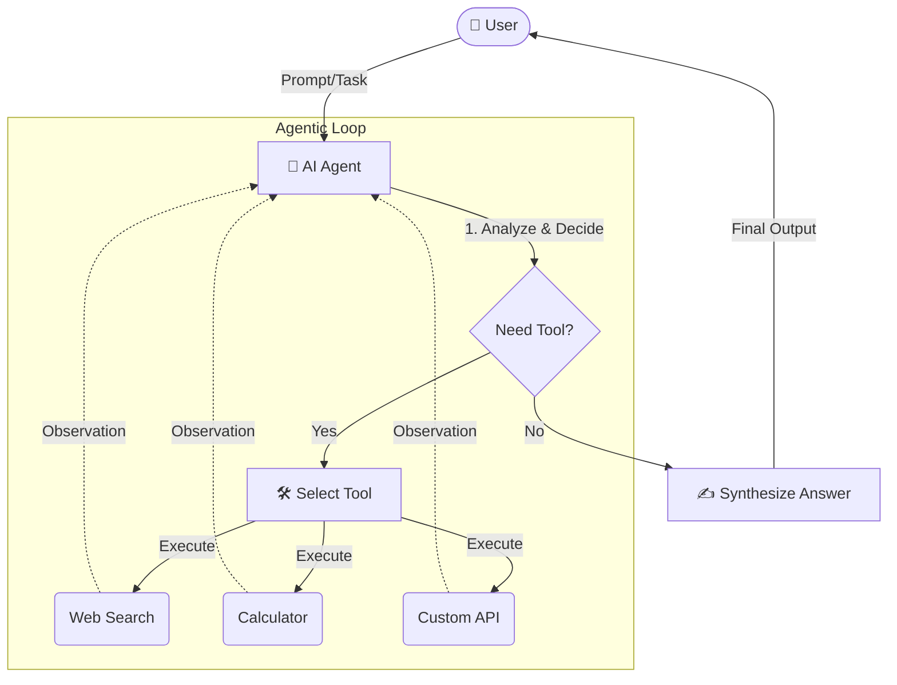

<div align="center">

# 🧪 Agentic AI Lab

[](https://www.python.org/downloads/)
[](https://python.langchain.com/)
[](https://deepmind.google/technologies/gemini/)
[](https://cloud.google.com/vertex-ai)
[](https://openai.com/)
[](https://groq.com/)
[](https://opensource.org/licenses/MIT)

*A comprehensive playground for building, testing, and exploring advanced AI Agents and LLM-powered applications.*

</div>

---

## 📖 Project Overview

**Agentic AI Lab** is a hands-on repository dedicated to exploring the capabilities of autonomous AI agents, tool calling mechanisms, and complex agent workflows. By leveraging state-of-the-art Large Language Models (LLMs) and frameworks like LangChain, this lab serves as a foundation for understanding how AI can be orchestrated to solve multi-step reasoning tasks, interact with external tools, and automate workflows.

**Objectives:**
- **Demonstrate Agentic Workflows:** Build autonomous agents capable of planning, observing, and executing actions.
- **Master Tool Calling:** Integrate external APIs, calculators, search engines, and custom functions directly into LLM reasoning loops.
- **Explore Prompt Engineering:** Optimize instructions for various models to achieve consistent and reliable structured outputs.
- **Multi-Model Integration:** Compare and contrast the capabilities of leading LLMs (Gemini, OpenAI, Groq, Vertex AI) within the same architectural patterns.

---

## ✨ Features

- 🤖 **Multi-Agent Systems:** Cooperative and hierarchical agent architectures.
- 🛠️ **Custom Tool Integration:** Python functions dynamically executed by LLMs.
- ⚡ **High-Speed Inference:** Utilizing Groq's LPU for ultra-fast reasoning.
- 🧠 **Advanced Reasoning:** ReAct (Reasoning and Acting) implementations.
- 📓 **Interactive Jupyter Notebooks:** Step-by-step tutorials and experiments.
- 🔄 **Memory Management:** Stateful agents with conversation history and context windows.

---

## 🏗️ Architecture & Workflow

In an agentic workflow, the LLM acts as the "brain," driving decision-making through a continuous loop of reasoning and acting.

1. **Input:** The user provides a complex query or task.
2. **Reasoning (Thought):** The Agent analyzes the task and determines if a tool is needed.
3. **Action:** The Agent invokes a specific tool with generated arguments.
4. **Observation:** The tool executes and returns the result back to the Agent.
5. **Synthesis (Response):** The Agent uses the observation to answer the user or loop back to step 2 if further action is required.

### Example Agent Workflow Diagram



---

## 🚀 Getting Started

### Prerequisites
- Python 3.11 or higher
- [uv](https://github.com/astral-sh/uv) (recommended) or `pip`

### Installation

**Using `uv` (Recommended for speed):**
```bash
# Clone the repository
git clone https://github.com/Prahants/llm-agent-playground.git
cd llm-agent-playground

# Create virtual environment and install dependencies
uv venv
source .venv/bin/activate
uv pip install -r requirements.txt
```

**Using `pip`:**
```bash
git clone https://github.com/Prahants/llm-agent-playground.git
cd llm-agent-playground

python -m venv .venv
source .venv/bin/activate # On Windows: .venv\Scripts\activate
pip install -r requirements.txt
```

### ⚙️ Environment Variable Setup

Create a `.env` file in the root directory and add your API keys. You only need the keys for the models you intend to use.

```env
# .env file
OPENAI_API_KEY="your_openai_api_key_here"
GOOGLE_API_KEY="your_google_gemini_api_key_here"
GROQ_API_KEY="your_groq_api_key_here"

# For Google Vertex AI (requires Google Cloud project setup)
GOOGLE_APPLICATION_CREDENTIALS="path/to/your/service_account.json"
GOOGLE_CLOUD_PROJECT="your_gcp_project_id"
```

> [!IMPORTANT]
> Never commit your `.env` file to version control. It is already included in the `.gitignore`.

---

## 💻 Usage Examples

### Initializing a LangChain Agent with Tool Calling

```python
import os
from dotenv import load_dotenv
from langchain_google_genai import ChatGoogleGenerativeAI
from langchain_core.tools import tool
from langchain.agents import create_tool_calling_agent, AgentExecutor
from langchain_core.prompts import ChatPromptTemplate

load_dotenv()

# 1. Define a tool
@tool
def calculate_growth_rate(initial: float, final: float) -> float:
    """Calculates the percentage growth rate between two numbers."""
    return ((final - initial) / initial) * 100

tools = [calculate_growth_rate]

# 2. Initialize the LLM
llm = ChatGoogleGenerativeAI(model="gemini-1.5-pro", temperature=0)

# 3. Create the prompt
prompt = ChatPromptTemplate.from_messages([
    ("system", "You are a helpful mathematical assistant."),
    ("human", "{input}"),
    ("placeholder", "{agent_scratchpad}"),
])

# 4. Construct and execute the agent
agent = create_tool_calling_agent(llm, tools, prompt)
agent_executor = AgentExecutor(agent=agent, tools=tools, verbose=True)

response = agent_executor.invoke({
    "input": "If revenue went from $50,000 to $85,000, what is the growth rate?"
})
print(response["output"])
```

---

## 🗂️ Project Structure

```text
llm-agent-playground/
├── .env                  # Environment variables (ignored in git)
├── .gitignore            # Git ignore rules
├── pyproject.toml        # Project metadata and dependencies
├── requirements.txt      # Python dependencies
├── README.md             # Project documentation
├── hello.py              # Simple test script
└── langchain/            # LangChain experiments
    └── 1-langchain.ipynb # Jupyter notebook for LangChain basics
```

---

## 🔌 Supported Models

This lab is designed to be model-agnostic, easily switching between leading providers:

| Provider | Library | Example Model(s) | Primary Use Case |
| :--- | :--- | :--- | :--- |
| **Google Gemini** | `langchain-google-genai` | `gemini-1.5-pro` | Massive context window (up to 2M tokens), multimodal tasks. |
| **Google Vertex AI** | `langchain-google-vertexai`| `gemini-1.5-flash` | Enterprise deployments, data privacy compliance on GCP. |
| **OpenAI** | `langchain-openai` | `gpt-4o`, `gpt-3.5-turbo` | Robust instruction following, complex reasoning. |
| **Groq** | `langchain-groq` | `llama3-70b-8192` | Ultra-fast token generation, real-time agentic interactions. |

---

## 🔮 Future Improvements

- [ ] Integrate **LangGraph** for complex, stateful multi-agent workflows (e.g., coding assistants, multi-persona debates).
- [ ] Add **RAG (Retrieval-Augmented Generation)** capabilities with vector databases (ChromaDB/Pinecone).
- [ ] Implement robust **Evaluation frameworks** (e.g., LangSmith or Ragas) to measure agent accuracy.
- [ ] Build a frontend UI using **Streamlit** or **Gradio** for easier interaction.

---

## 🤝 Contributing

Contributions are welcome! If you have a new tool integration, a unique prompt strategy, or a different multi-agent setup:

1. Fork the Project.
2. Create your Feature Branch (`git checkout -b feature/AmazingFeature`).
3. Commit your Changes (`git commit -m 'Add some AmazingFeature'`).
4. Push to the Branch (`git push origin feature/AmazingFeature`).
5. Open a Pull Request.

---

## 📄 License

Distributed under the MIT License. See `LICENSE` for more information.

---
<div align="center">
  <i>Built to showcase modern AI Engineering and Agentic Workflows.</i>
</div>
